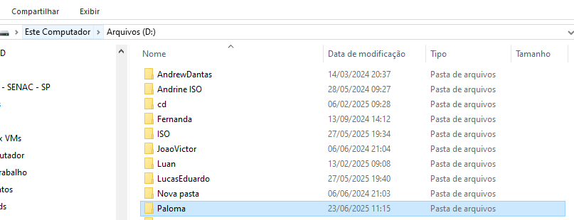
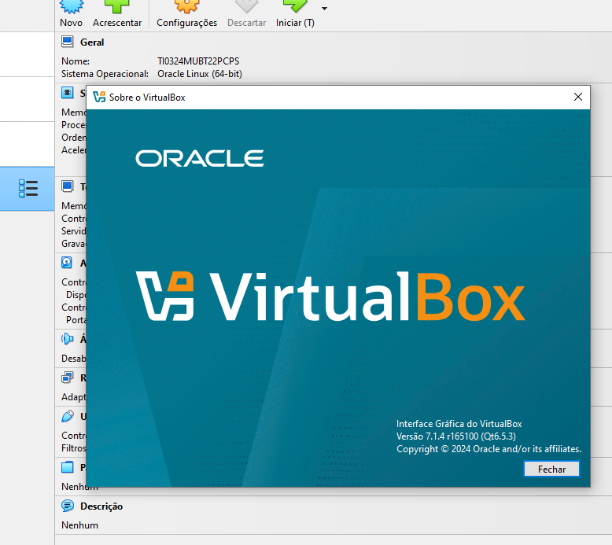
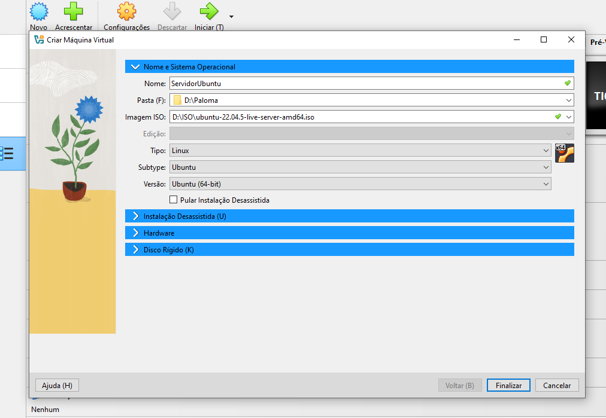
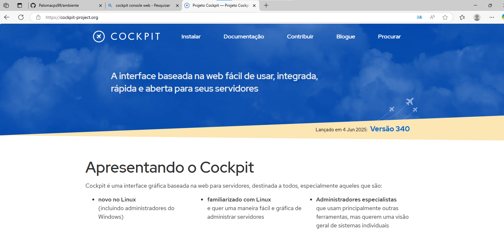

# Preparação de Ambiente
Criar uma máquina virtual para instalar as ferramentas e depedência, para 
o algoritimo e lógica de programação. 

## Criar o diretório base
Vamos criar um diretório, para guardar a nossa máquina virtual.Será criado no 
drive D.Nomeada com o nome do usuário.



## Preparação da máquina virtual
### Vamos usara ferramenta de vitualização chamada virtual box



<a href="https://www.virtualbox.org/wiki/Downloads"> Faça o download aqui </a>


## Ciando a máquina virtual



## Crie uma máquina virtual com as seguintes configurações. 
- Crie um diretório no drive D para alocar a sua máquina virtual.
- Processador: 2
- Mméorória de vídeo: 128.
- Disco: 100GB dinamicamente alocado.
- Iso: Ubunto 24.04
    - Idioma: Português Brasil
    - Localização: São Paulo
    - Usuário: Paloma
    - Senha: P@ssword
    - Comandos de atualização do sistema:
        - sudo apt update -y
        - sudo apt upgrade -y
        - reboot
        - instalar o cockpit

      ## Pós instalação:

      Para atualizar o sistema, iremos usar os seguintes comandos:

 ``` shell
 sudo apt update -y
 ```

 ```shell
 sudo apt upgrade -y
 ```

 ou

 ```shell
 sudo apt update -y && sudo apt upgrade -y
 ```

 ## Instalação do cockpit
 
 Ferramenta para gerenciar o servidor, por meio de um ambiente gráfico online.

 

 ### comando para instalar o cockpit

 ```shell
 sudo apt install cockpit -y
 ```


     


    


